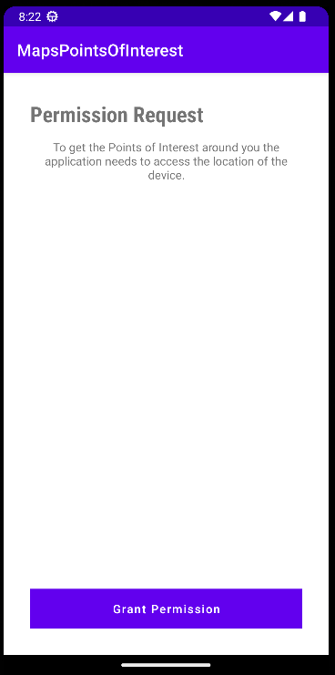
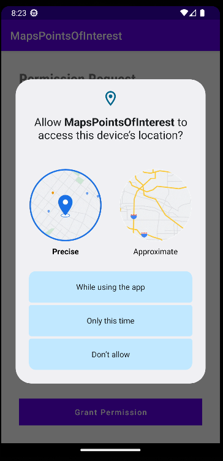
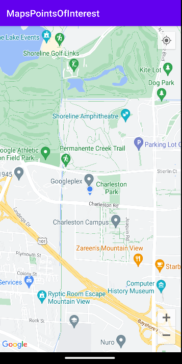

## Points of interest around me
This repository contains a android application that displays on google maps all points of
interest around your device.

When the application opens, a page appears asking for permission to access the users's
location.

After obtaining the location, the application opens google maps centered on the devices
location, showing all points of interest around it.

